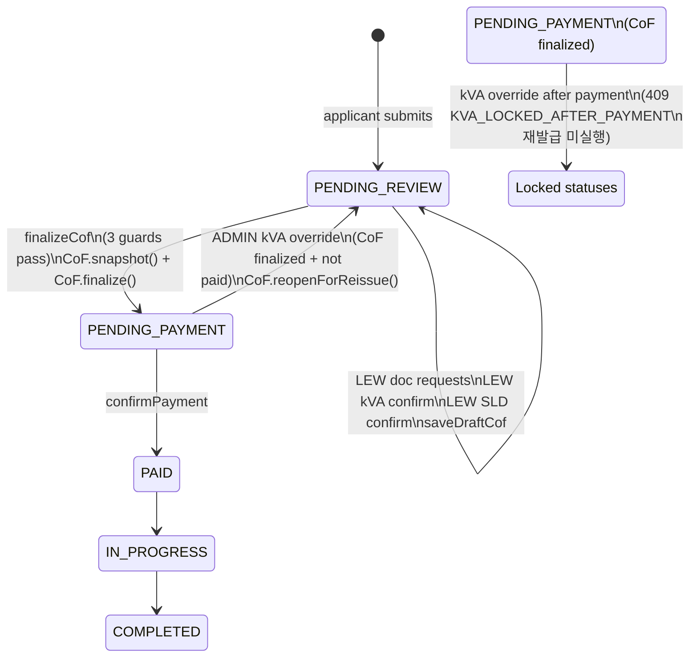

# Phase 6 — State Machine

**대상**: Application status × CoF finalized × kvaStatus 3축 상태 전이. 특히 kVA override로 인한 CoF 재발급 엣지 케이스를 명세한다.

---

## 1. 축 정의

| 축 | 값 | 출처 |
|---|---|---|
| Application.status | PENDING_REVIEW / REVISION_REQUESTED / PENDING_PAYMENT / PAID / IN_PROGRESS / COMPLETED / EXPIRED | `ApplicationStatus` enum |
| CoF.finalized | true / false / (레코드 없음) | `certifiedAt IS NOT NULL` |
| Application.kvaStatus | UNKNOWN / CONFIRMED | `KvaStatus` enum |

**LOCKED_STATUSES** (결제 이후): `{PAID, IN_PROGRESS, COMPLETED, EXPIRED}` — kVA 변경 금지

---

## 2. 정상 전이 (Happy Path)

```
┌─────────────────────┐
│ APPLICATION_CREATED │
│ status=PENDING_REVIEW│
│ kvaStatus=UNKNOWN    │
│ CoF=none             │
└──────────┬──────────┘
           │
           │ (LEW: 서류 요청 ↔ 신청자 보완) ×반복
           │ Application.status 변경 없음, CoF 없음
           │
           ▼
┌─────────────────────┐
│ LEW confirmKva       │
│ status=PENDING_REVIEW│
│ kvaStatus=CONFIRMED  │ ← 또한 Application.selectedKva 갱신
│ CoF=none or Draft    │
└──────────┬──────────┘
           │
           │ (LEW: saveDraftCof — CoF Draft 자동 생성/동기화)
           │ CoF.approvedLoadKva = Application.selectedKva
           │
           ▼
┌─────────────────────┐
│ SLD 확정              │ (sldOption=REQUEST_LEW만 해당)
│ SldRequest.status     │
│  = CONFIRMED          │
└──────────┬──────────┘
           │
           │ (LEW: finalizeCof — 3가드 통과)
           │ CoF.snapshotApprovedLoadKva(Application.selectedKva)
           │ CoF.finalize(lewUser, consentDate)
           │ Application.approveForPayment()
           │
           ▼
┌─────────────────────┐
│ PENDING_PAYMENT      │
│ kvaStatus=CONFIRMED  │
│ CoF.finalized=true   │ ← IMMUTABLE (kVA override 외엔 수정 불가)
└──────────┬──────────┘
           │
           │ (ADMIN: confirmPayment)
           ▼
        PAID → IN_PROGRESS → COMPLETED
```

---

## 3. kVA Override × CoF 재발급 (Edge Case "b")

### 3-1. 트리거 조건
`force=true` 로 `PATCH /api/admin/applications/{id}/kva` 호출. 다음 셀에 도달하면 재발급 분기가 실행된다:

| Application.status | CoF.finalized | 결과 |
|---|---|---|
| PENDING_REVIEW | (any) | 단순 override. 재발급 미실행 |
| **PENDING_PAYMENT** | **true** | **재발급 실행** ✓ |
| PENDING_PAYMENT | false | 단순 override. 재발급 미실행 |
| PENDING_PAYMENT | CoF 없음 | 단순 override. 재발급 미실행 |
| PAID/IN_PROGRESS/COMPLETED/EXPIRED | (any) | 409 `KVA_LOCKED_AFTER_PAYMENT`. override 자체 불가 |

### 3-2. 재발급 분기 다이어그램

```
[PENDING_PAYMENT + CoF.finalized]
    │
    │ PATCH /kva { selectedKva: Y', note, force=true }
    │
    ▼
┌──────────────────────────────────────────────┐
│ ApplicationKvaService.confirm()               │
│  1. isLockedStatus(current) → false (pass)    │
│  2. previousStatus=CONFIRMED, force=true      │
│     → 통과 (override 허용)                     │
│  3. application.confirmKva(Y', newQuote, ...)  │
│     → selectedKva=Y', kvaStatus=CONFIRMED 유지 │
│     (kvaSource=LEW_VERIFIED 유지)             │
│  4. cofRepository.find(appId)                 │
│     → existingCof 조회                         │
│  5. cof.isFinalized() && status==             │
│     PENDING_PAYMENT → 재발급 분기 진입          │
│       a. cof.reopenForReissue(Y')             │
│          - certifiedAt = null                 │
│          - lewConsentDate = null              │
│          - approvedLoadKva = Y' (새 스냅샷)    │
│          - certifiedByLew 보존                │
│       b. application.reopenForCofReissue()    │
│          - status: PENDING_PAYMENT→PENDING_   │
│            REVIEW                             │
│       c. cofReissued = true                   │
│  6. 감사 로그:                                  │
│     - KVA_OVERRIDDEN_BY_ADMIN (항상)           │
│     - COF_REISSUED_BY_KVA_OVERRIDE (재발급)    │
│  7. 알림:                                       │
│     - Applicant: KVA_CONFIRMED                │
│     - LEW: COF_REISSUED_BY_KVA_OVERRIDE       │
│     - Applicant: COF_REISSUED_BY_KVA_OVERRIDE │
└──────────────────────────────────────────────┘
    │
    ▼
[PENDING_REVIEW + CoF.finalized=false + kvaStatus=CONFIRMED]
    │
    │ (LEW 재진입: /lew/applications/:id/review)
    │ GuardChecklist:
    │   ✓ kVA confirmed
    │   ✓ Documents resolved (기존 상태 유지)
    │   ✓ SLD confirmed (기존 상태 유지)
    │ → Finalize 즉시 가능 (모든 가드 통과)
    │
    │ (LEW: Finalize & Submit 클릭)
    │ finalizeCof():
    │   - 3가드 통과
    │   - cof.snapshotApprovedLoadKva(Y')  ← 다시 스냅샷
    │   - cof.finalize(lewUser, today)     ← certifiedAt 재설정
    │   - application.approveForPayment()
    │
    ▼
[PENDING_PAYMENT + CoF.finalized=true (재서명됨) + selectedKva=Y']
```

### 3-3. 경계 조건

| 시나리오 | 처리 |
|---|---|
| ADMIN이 동일 kVA로 override 시도 (`Y' == Y`) | `application.confirmKva` 성공, CoF 재발급 분기 실행. 운영상 의미 없는 override지만 서버는 일관되게 처리. |
| 낙관적 락 충돌 (동시에 LEW가 finalize 재시도 & ADMIN이 override) | `@Version` 충돌 → 하나가 409 `STALE_STATE` 수신 |
| CoF가 soft-deleted 상태 | `findByApplication_ApplicationSeq`에 `@SQLRestriction("deleted_at IS NULL")`로 이미 필터링 |

---

## 4. 가드 실패 시 상태 변화 (finalize 관점)

| 가드 | 실패 시 서버 응답 | 상태 변화 |
|---|---|---|
| `kvaStatus != CONFIRMED` | 400 `KVA_NOT_CONFIRMED` | **없음** (finalize 미실행) |
| 미해결 DocumentRequest | 400 `DOCUMENT_REQUESTS_PENDING` | 없음 |
| `sldOption=REQUEST_LEW` && SLD 미확정 | 400 `SLD_NOT_CONFIRMED` | 없음 |
| MSSL/consumer/voltage/… 필수 필드 누락 | 400 `COF_VALIDATION_FAILED` | 없음 |
| CoF 이미 finalized | 409 `COF_ALREADY_FINALIZED` | 없음 |
| Application.status != PENDING_REVIEW | 409 `COF_VALIDATION_FAILED` (상태 불일치) | 없음 |
| 낙관적 락 충돌 | 409 `STALE_STATE` | 없음 |
| 권한 실패 (배정 LEW 아님) | 403 `APPLICATION_NOT_ASSIGNED` | 없음 |

**원칙**: 가드 실패는 side effect 없음. DB mutation은 모든 가드 통과 후 단일 트랜잭션.

---

## 5. 상태 불변성 체크리스트

- [x] `CoF.finalized=true` 상태에서 `approvedLoadKva` 수정 불가 (`updateFields` / `snapshotApprovedLoadKva` / `updateMssl`이 `IllegalStateException`)
- [x] `CoF.finalized=false`로 전환은 `reopenForReissue`로만 (직접 `certifiedAt=null` 대입 없음)
- [x] `Application.reopenForCofReissue`는 `PENDING_PAYMENT`에서만 호출 가능 (`IllegalStateException` 가드)
- [x] `Application.confirmKva(force=false)` + `kvaStatus=CONFIRMED` → `IllegalStateException` (도메인 가드)
- [x] 결제 이후 kVA override 시도 → 서비스 레이어에서 차단 (409 전에 감사 로그 기록)

---

## 6. 참고: Phase 5 가드와의 관계

Phase 5 PR#1 (kVA 확정)의 가드는 다음과 같이 유지된다:

- **B-3 LOCKED_AFTER_PAYMENT**: 결제 이후 kVA 변경 차단 — Phase 6도 그대로 유지 (재발급 분기 **이전**에 검사)
- **AC-P1 ALREADY_CONFIRMED**: `force=false`로 이미 CONFIRMED 재확정 시도 → 409 — Phase 6도 유지
- **AC-A2 권한**: LEW는 assigned 일치 시만 — Phase 6도 유지
- **낙관적 락**: `@Version` — Phase 6도 그대로 사용

**Phase 6 추가 분기**: 위 가드들을 모두 통과한 후, `force=true`이고 `previousStatus=CONFIRMED`이며 CoF가 finalized이고 application이 PENDING_PAYMENT일 때만 재발급 실행. 그 외에는 기존 Phase 5 동작 그대로.

---

## 7. 다이어그램 텍스트 표현 (Mermaid)



---

**관련 문서**
- `01-spec.md` §5 — 상태 머신 요약
- `03-data-model.md` §3 — 스냅샷 정책
- `05-test-plan.md` — 상태 전이 테스트 케이스
